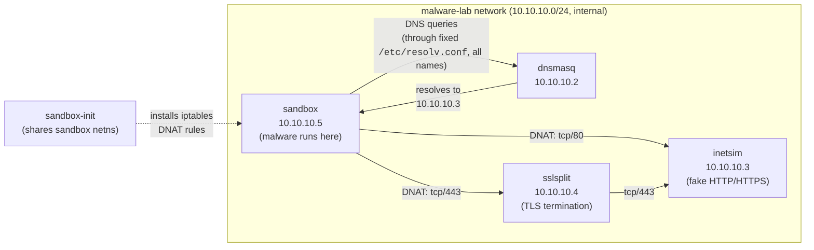
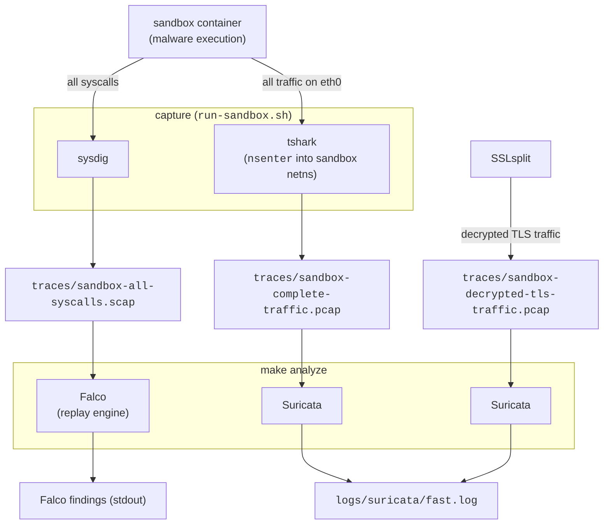

# co-malbox

A container-based malware sandbox that runs suspect binaries in an isolated network while faking
internet connectivity, and captures all traffic and syscalls for later analysis.

## Architecture

The sandbox is built around a private network (10.10.10.0/24), a DNS sinkhole, fake internet services, a TLS interception proxy,
and a monitoring layer.

- **`sandbox`** (10.10.10.5) — the analysis container. Minimal Python 3.13-slim image (`Dockerfile-sandbox`),
  runs as unprivileged user `sandbox`, entrypoint is just `sleep infinity` (the malware/tools get
  injected/exec'd into it at runtime). It trusts the custom root CA cert `sslsplit-ca.crt` so TLS interception
  doesn't trip cert warnings.
- **`sandbox-init`** — a one-shot init job that shares the sandbox's network namespace
  (`network_mode: service:sandbox`) and runs `init-sandbox.sh` to install netfilter / iptables DNAT rules: all
  outbound traffic to port 80 → INetSim directly, all outbound traffic to port 443 → SSLsplit (which then forwards the
  traffic to INetSim).
- **`dnsmasq`** (10.10.10.2) — resolves *every* DNS name to 10.10.10.3 (INetSim), preventing DNS-based
  exfiltration / lookups from leaking real data.
- **`inetsim`** (10.10.10.3) — simulates internet services (HTTP/HTTPS enabled in `inetsim.conf`,
  everything else disabled). Returns canned files (`sample.html`, `sample_gui.exe`, etc.) for
  any request, so malware "sees" a plausible internet.
- **`sslsplit`** (10.10.10.4) — MITMs the HTTPS traffic redirected to it, terminates TLS using the
  shared CA cert / key, and forwards to INetSim (10.10.10.3:443), while dumping decrypted traffic to a
  `.pcap` file in `./traces`.

### Orchestration & analysis tooling

- **`run-sandbox.sh`** — brings up the compose stack, then attaches `tshark` (via `nsenter` into the
  sandbox's network namespace, so the malware can't see the sniffer in its own process list) and `sysdig` to
  capture full traffic (`.pcap`) and all syscalls (`.scap`) into `./traces` for the session.
- **`Makefile`** — `install` (host deps: podman, suricata, sysdig, falco), `cert` (generates the shared
  CA used by INetSim / SSLsplit / sandbox), `containers` (builds images), `run` (calls `run-sandbox.sh`),
  and `analyze` (replays the `.scap` files through Falco for suspicious syscalls, and the `.pcap` files through
  Suricata for network IoCs, dumping results into `logs/`).
- **`smoke-test.sh`** — sanity commands to verify Falco / Suricata rules actually fire (reading
  `/etc/shadow`, DNS query for a `.onion` domain, PHP user-agent to trigger ET rules).

## Diagrams

### Traffic flow

### Data / analysis flow

## Running an analysis

Perform the following steps to run an analysis:
1. `make install` - Install all dependencies on the host (only once).
2. `make run` - Start the sandbox, press any key to see the container logs.
3. In the sandbox container: Run a malware sample, install packages that might be tainted...
4. In the shell where you ran `make run`: Press Ctrl-C to stop the sandbox.
5. `make analyze`: - Analyze the recorded syscalls (`traces/sandbox-all-syscalls.scap`) and network traffic
    (`traces/sandbox-complete-traffic.pcap` and `traces/sandbox-decrypted-tls-traffic.pcap`) for suspicious behavior /
    indicators of compromise (IoCs).
6. Optional: Manually inspect the `.scap` and `.pcap` files with Stratoshark / Wireshark.
