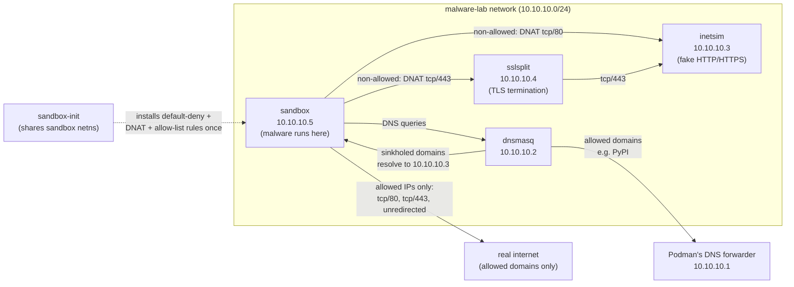
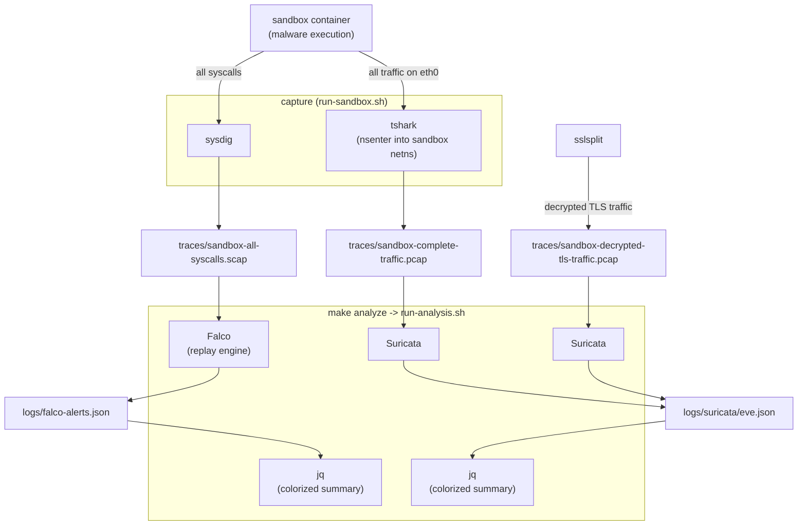

# co-malbox

A container-based malware sandbox that runs suspect binaries in an isolated network while faking
internet connectivity, and captures all traffic and syscalls for later analysis.

> [!WARNING]
> Containers aren't a hard security boundary for malware. They still share the host kernel — a kernel exploit or container escape
> lands directly on your machine. For hostile samples you are strongly advised to run this whole stack inside a disposable /
> snapshotted VM rather than directly on your workstation.

## Architecture

The sandbox is built around a private network (10.10.10.0/24), a DNS sinkhole with a small allow-list, fake internet services, a
TLS interception proxy, and a default-deny firewall.

- **`sandbox`** (10.10.10.5) — the analysis container. Minimal Python 3.13-slim image (`Dockerfile-sandbox`),
  runs as unprivileged user `sandbox`, entrypoint is just `sleep infinity` (the malware/tools get
  injected/exec'd into it at runtime). It trusts the custom root CA cert `sslsplit-ca.crt` so TLS interception
  doesn't trip cert warnings.
- **`sandbox-init`** — a one-shot init job that shares the sandbox's network namespace
  (`network_mode: service:sandbox`) and runs `init-sandbox.sh` to install netfilter / iptables rules, in order:
  1. Default-deny: the `OUTPUT` chain's policy is set to `DROP` first, so a failure partway through the script still fails
     closed instead of leaving traffic unrestricted.
  2. Allow loopback and DNS queries to `dnsmasq`.
  3. Exempt the allowed destinations (IPs resolved on the host by `run-sandbox.sh`, e.g. for PyPI) from the DNAT redirects
     below, so they reach the real internet directly.
  4. Redirect all other outbound traffic to port 80 → INetSim directly, and to port 443 → SSLsplit (which then forwards it
     to INetSim). Everything else (any other port/protocol) stays dropped by the default-deny policy.
- **`dnsmasq`** (10.10.10.2) — resolves DNS names to 10.10.10.3 (INetSim) by default, preventing DNS-based exfiltration /
  lookups from leaking real data — *except* for the domains in `run-sandbox.sh`'s `ALLOWED_DOMAINS`, which it forwards to
  Podman's own per-network DNS forwarder (10.10.10.1, which in turn asks the resolver configured on the host) so they
  resolve to their real IP.
- **`inetsim`** (10.10.10.3) — simulates internet services (HTTP/HTTPS enabled in `inetsim.conf`,
  everything else disabled). Returns canned files (`sample.html`, `sample_gui.exe`, etc.) for
  any request, so malware "sees" a plausible internet.
- **`sslsplit`** (10.10.10.4) — MITMs the HTTPS traffic redirected to it, terminates TLS using the
  shared CA cert / key, and forwards to INetSim (10.10.10.3:443), while dumping decrypted traffic to a
  `.pcap` file in `./traces`.

All containers run with `cap_drop: [ALL]` plus only the specific capabilities each one actually needs, a read-only root
filesystem (with `tmpfs` mounts for whatever they legitimately need to write), and CPU / memory / PID limits — so a hostile
sample can't fork-bomb, OOM, or otherwise abuse the host, and a container that doesn't need a capability (e.g. to bind a
privileged port, or to drop root privileges internally) simply doesn't have it. See the inline comments in `docker-compose.yml`
for why each specific capability is needed (some of them, like INetSim needing `SETUID` / `SETGID` / `CHOWN` / `KILL`, are
distinctly non-obvious).

We considered adding a dedicated, dual-homed egress gateway container instead of letting `sandbox` reach the real internet
directly for allowed destinations — see the comment at the top of `docker-compose.yml` for that design and why we didn't build
it (yet).

### Orchestration & analysis tooling

- **`run-sandbox.sh`** — resolves `ALLOWED_DOMAINS` (e.g. `pypi.org`) to IP addresses on the host and generates
  `dnsmasq-allowed-domains.conf` (per-domain `server=` overrides for `dnsmasq`) and `allowed-ips.txt` (consumed by
  `sandbox-init`'s firewall rules) before bringing up the compose stack. It then attaches `tshark` (via `nsenter` into the
  sandbox's network namespace, so the malware can't see the sniffer in its own process list) and `sysdig` to capture full
  traffic (`.pcap`) and all syscalls (`.scap`) into `./traces` for the session.
- **`run-analysis.sh`** (invoked via `make analyze`) — replays `traces/sandbox-all-syscalls.scap` through Falco (JSON output to
  `logs/falco-alerts.json`) and both `.pcap` files through Suricata (`logs/suricata/eve.json`), then prints a colorized,
  one-line-per-alert summary of each via `jq` (color keyed to Falco's `priority` / Suricata's `alert.severity`).
- **`Makefile`** — `install` (host deps: podman, suricata, sysdig, falco, jq), `cert` (generates the shared CA used by
  INetSim / SSLsplit / sandbox), `containers` (builds images), `run` (calls `run-sandbox.sh`), and `analyze` (calls
  `run-analysis.sh`).
- **`smoke-test.sh`** — sanity commands to verify Falco / Suricata rules actually fire (reading
  `/etc/shadow`, DNS query for a `.onion` domain, PHP user-agent to trigger ET rules).

## Diagrams

### Traffic flow

### Data / analysis flow

## Running an analysis

Perform the following steps to run an analysis:
1. `make install` - Install all dependencies on the host (only once).
2. `make run` - Start the sandbox, press any key to see the container logs.
3. In the sandbox container: Run a malware sample, install packages that might be tainted...
4. In the shell where you ran `make run`: Press Ctrl-C to stop the sandbox.
5. `make analyze`: - Analyze the recorded syscalls (`traces/sandbox-all-syscalls.scap`) and network traffic
    (`traces/sandbox-complete-traffic.pcap` and `traces/sandbox-decrypted-tls-traffic.pcap`) for suspicious behavior /
    indicators of compromise (IoCs). Prints a colorized alert summary; full JSON details end up in `logs/`.
6. Optional: Manually inspect the `.scap` and `.pcap` files with Stratoshark / Wireshark.
